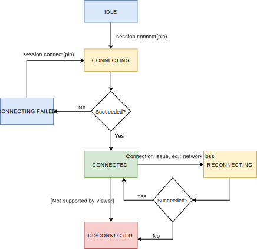

# Rescue Live iOS SDK

- [Introduction](#Introduction)
- [Requirements](#requirements)
- [Installation](#installation)
- [Known Issues](#known-issues)
- [Support Flow](#support-flow)
- [Usage](#usage)
- [Bugs](#bugs)

## Introduction

The Rescue Live Mobile SDK allows your customers to establish a Rescue Live support session within your app.

Take advantage of In-App Support:

- Gain access to end-user app issues and enable quicker problem resolution without the end-user ever leaving the app
- Optimize the customer experience with a seamless, intuitive customer support solution
- Reduce app abandonment levels
- Maximize customer satisfaction

The support representatives will be able to create remote app sharing sessions from the same Agent Console where the web-based co-browse sessions are managed.

## Requirements

To use the SDK you will need an API key from your LogMeIn Rescue Live Guide point of contact.

Your development environment must meet the following requirements:

- App Deployment Target: iOS 11.0 or later
- Supported Architectures: arm64, x86_64
- CocoaPods 1.9 or later

**Important:** This SDK uses the OpenSSL library for secure communication next to ones provided by Apple. By using our product, you may be subject to different software export regulations that apply in your country. 

## Installation

You can integrate Rescue Live iOS SDK into your project via CocoaPods. To read more about usage and installation instructions, visit their website. Specify the SDK in your `Podfile` as follows: 

```ruby
platform :ios, '11.0'
use_frameworks!

target 'YourApp' do
  pod 'RescueLive', '~> 1.0'
end

post_install do |installer|
  installer.pods_project.targets.each do |target|
    if ['Starscream'].include? target.name
      target.build_configurations.each do |config|
        config.build_settings['BUILD_LIBRARY_FOR_DISTRIBUTION'] = 'YES'
      end
    end
  end
end
```

### Binary Size

In the build settings of your app set `Enable Bitcode` to `Yes` to get the smallest possible download and installation size of our SDK. The download size (i.e. in your .ipa file) is approximately 11 MB.

## Known Issues

### CocoaPods post-install hook

The Rescue Live iOS SDK is shipped in .xcframework format. When working with .xcframework format all dependent frameworks have to be built as .xcframework. Consequently set the `Build Libraries for Distribution` build setting to `Yes` for the Starscream library (the only dependency of the SDK). The Podfile above demonstrates how to achieve this via a CocoaPods post-install hook.

## Support Flow

The Rescue Live Mobile SDK leverages the same PIN-based connection as the web co-browse solution. The main difference is that in the case of Mobile SDK the session PIN is currently generated by the support representative in the Agent Console and the PIN code is to be entered in the supported mobile app.

High-level flow today:

1. Support representative and customer are engaged via phone/chat
2. Support representative to create a Mobile App support session in the Agent Console (generates a 9-digit PIN)
3. Customer to enter PIN to the input field within the app (the PIN entry fields needs to be implemented by app owner when adding the SDK to the app)
4. Customer to hit connect button (also to be implemented by app owner)
5. Screen sharing started

## Usage

You can see below how you can initiate and close a support session in your app.

## Session states

`RescueLiveSession` goes through different states during its lifecycle. The current state is available via the `state` property and the `rescueSessionStateDidChangeTo(_ newState: RescueLiveSessionState)` delegate method.



**`RescueLiveSession` objects are not re-usable.** Do not call the `RescueLiveSession.connect(...)` method when it has already left the `idle` state, rather create a new instance for a subsequent session.

### Data Masking

Add sensitive `UIView` objects to the `hiddenViews` property of the session object to hide sensitive information from the support representative before sending over the customer's screen.

**Important:** The SDK only supports masking of views whose `frame` is not animated during the session. By default iOS animates the frame of views when the user rotates his device, therefore it is recommended to **disable interface orientation change during the session** to avoid sensitive data leakage.

### Sample Code

In Swift:

```swift
import RescueLive

class YourClass: RescueLiveSessionDelegate {
    var supportSession: RescueLiveSession?

    func connect() {
        supportSession = RescueLiveSession(apiKey: "YOUR_API_KEY")
        supportSession?.delegate = self
        supportSession?.hiddenViews.insert(sensitiveView)

        supportSession?.connect(withKey: "123456789")
    }

    func disconnect() {
        supportSession?.disconnect()
        supportSession = nil
    }
}
```

In Objective-C:

```objective-c
@import RescueLive;

@interface YourClass () <RescueLiveSessionDelegate>

@property (nonatomic, strong) RescueLiveSession *supportSession;

@end

@implementation CViewController

- (void)connect {
    self.supportSession = [[RescueLiveSession alloc] initWithApiKey:@"YOUR_API_KEY"];
    self.supportSession.delegate = self;
    self.supportSession.hiddenViews = [NSSet setWithObjects:sensitiveView, nil];

    [self.supportSession connectWithKey:@"123456789"];
}

- (void)disconnect {
    [self.supportSession disconnect];
    self.supportSession = nil;
}

@end
```

## Bugs

If you **found a bug**, please open an issue here on GitHub.
